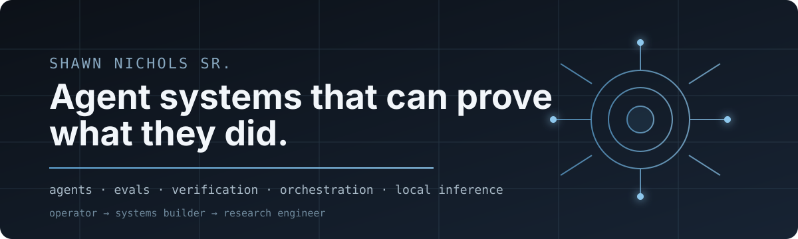
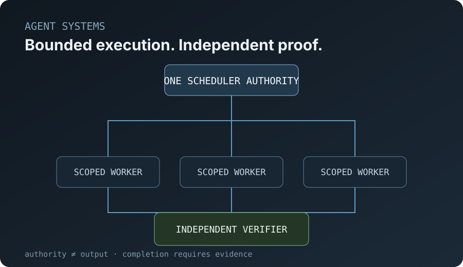
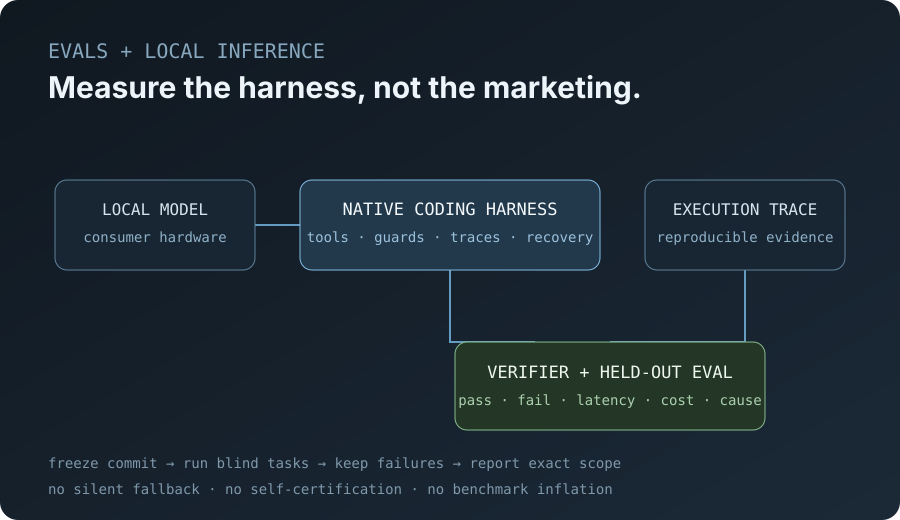
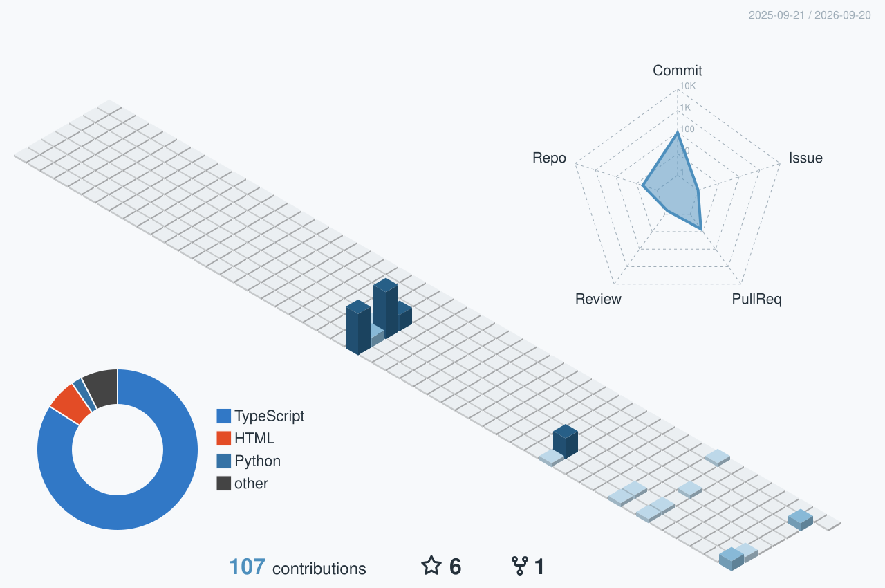

<!--
============================================================
  Shawn Nichols Sr. — profile README
  Proof-first profile for agent systems, evaluations, and local inference.
============================================================
-->

  

### /* public proof */

<table>
<tr><td><code>01</code></td><td><b><a href="https://github.com/Shawn5cents/agentskin">AgentSkin</a></b></td><td>author</td><td>Semantic data reduction for AI agents — an MCP-first system for pruning noisy API responses before they reach the model.</td></tr>
<tr><td><code>02</code></td><td><b><a href="https://github.com/Shawn5cents/grok-build-legion-edition">Grok Build Legion Edition</a></b></td><td>downstream</td><td>xAI Grok Build community fork adding heterogeneous model routing, role-specific agents, independent verification, bounded repair, and provider discovery.</td></tr>
<tr><td><code>03</code></td><td><b><a href="https://github.com/Shawn5cents/agent-zero-nvidia-nim">agent-zero-nvidia-nim</a></b></td><td>author</td><td>NVIDIA NIM chat + embedding provider for Agent Zero with live model discovery and self-hosted endpoint support.</td></tr>
</table>

### /* selected research systems */

<table>
<tr><td><code>01</code></td><td><b>Invariant</b></td><td>private</td><td>Autonomous engineering runtime built around one rule: <b>a builder does not certify its own work</b>. Sandboxed execution, independent verification, repair loops, replay, and release gates.</td></tr>
<tr><td><code>02</code></td><td><b>micro-cpp-harness</b></td><td>private</td><td>Native C++20 coding-agent harness for local open-weight inference, verifier-gated execution, trajectory capture, recovery, and reproducible benchmark qualification.</td></tr>
<tr><td><code>03</code></td><td><b>Particle</b></td><td>private</td><td>Recursive agent runtime with scoped workers, persistent specialists, context isolation, durable goals, recovery, and orchestration state outside the transcript.</td></tr>
<tr><td><code>04</code></td><td><b>Agent Mode Benchmark Lab</b></td><td>private</td><td>Original evaluation program for coding, computer use, interactive products, games, and long-horizon agent work with locked briefs, clean workspaces, provenance, and deterministic scoring.</td></tr>
<tr><td><code>05</code></td><td><b>Collective</b></td><td>private</td><td>Distributed AI control plane with one Scheduler authority, bounded capabilities, exact routing, signed evidence, independent verification, and safe recovery.</td></tr>
</table>

### /* product systems */

<table>
<tr><td><code>01</code></td><td><b>Link2Note</b></td><td>private product</td><td>Turns links, videos, PDFs, audio, playlists, and channels into structured notes, transcripts, archives, and files; includes auth, billing, gated workflows, and staged multi-model study/review modes.</td></tr>
<tr><td><code>02</code></td><td><b>OpenSwitch</b></td><td>private product</td><td>OpenAI-compatible marketplace that deterministically routes model + provider by capability, benchmark quality, latency, health, funding state, terms, and cost.</td></tr>
<tr><td><code>03</code></td><td><b>Chirp</b></td><td>private alpha</td><td>Push-to-talk interaction layer for existing AI chats and human channels while preserving the underlying conversation's context, tools, and history.</td></tr>
</table>

Private systems are available by demo or granted repository access where appropriate.

### /* showcase */

<table width="100%">
<tr>
<td width="50%"></td>
<td width="50%"></td>
</tr>
<tr>
<td align="center"><code>01</code> Invariant + Collective — authority, bounded execution, independent proof</td>
<td align="center"><code>02</code> micro-cpp + Agent Mode — local inference, traces, controlled qualification, reproducible evals</td>
</tr>
</table>

### /* operating background */

<table>
<tr><td><code>01</code></td><td><b>Walmart cold chain</b></td><td>Managed time-critical compliance operations where traceability, process discipline, service reliability, and failure recovery were hard requirements.</td></tr>
<tr><td><code>02</code></td><td><b>Mercedes JIT</b></td><td>Managed just-in-time automotive logistics where sequencing, dependencies, timing, escalation, and recovery directly affected downstream operations.</td></tr>
<tr><td><code>03</code></td><td><b>mechanism transfer</b></td><td>I learned systems in operations before I learned them in code: route the right resource, bound authority, preserve evidence, verify independently, and recover safely.</td></tr>
</table>

### /* principles */

<pre>
information != authority
claimed completion != verified completion
model choice != capability proof
failure data is part of the result
</pre>

### /* contributions */

  

  <b>Shawn Nichols Sr.</b> · Independent Research Engineer — Agents, Evals &amp; Local Inference · <a href="https://github.com/Shawn5cents">@Shawn5cents</a> · <a href="https://agentskin.dev">agentskin.dev</a>

<!--
NOTES
1) The 3D contribution graph is generated by .github/workflows/profile-3d.yml.
2) Flagship private systems are described but intentionally not linked.
3) Keep claims conservative: measured evidence over marketing superlatives.
4) Preserve upstream/model/reference attribution in every project.
5) Do not describe the current micro-cpp qualification set as a blind held-out benchmark until that experiment is run.
-->
